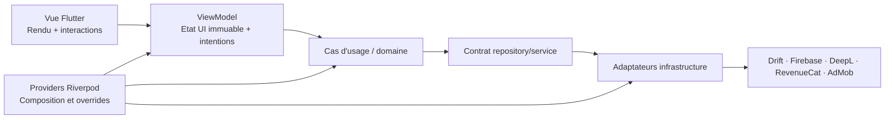

# Contrat de migration

## Architecture cible

Chaque fonctionnalité possède ses vues, son état UI immuable, son ViewModel, ses cas d’usage/contrats de domaine et ses adaptateurs d’infrastructure. Les modèles de domaine et contrats partagés peuvent rester dans `core/`; l’assemblage des dépendances reste dans des providers Riverpod.

| Élément | Responsabilité | Interdit |
|---|---|---|
| Vue | Afficher l’état et transmettre les interactions utilisateur | Logique métier, accès SDK, instanciation Firebase/Drift/RevenueCat |
| ViewModel | Exécuter les intentions, orchestrer les cas d’usage, publier un état UI immuable typé | `BuildContext` comme dépendance métier, accès direct aux SDK |
| Cas d’usage/domaine | Appliquer les règles de cartes, review, statistiques et politiques applicatives | Widgets, plugins Flutter, état de présentation mutable |
| Adaptateur | Traduire un contrat applicatif vers Drift, Firebase, DeepL, RevenueCat, AdMob ou préférences | Décider de l’état UI |
| Provider Riverpod | Composer les dépendances et fournir les overrides de test | Contenir une règle métier non testée |

Un état UI expose au minimum une phase explicite (`initial`, `loading`, `data`, `error`), les données nécessaires à l’écran et une erreur applicative typée lorsque l’action échoue. Les erreurs d’infrastructure sont mappées à une erreur applicative à la frontière adaptateur/contrat ; une erreur ne doit pas laisser l’UI dans un état ambigu.

## Invariants fonctionnels à caractériser

| Domaine | Invariant à préserver | Caractérisation attendue |
|---|---|---|
| Cartes | L’ajout refuse une face vide ou un doublon et crée deux cartes inversées avec langues inversées. | Ajouter, relire le stockage, vérifier les deux directions et les refus. |
| Cartes | Modifier ou supprimer une paire affecte ses deux directions ; la limite existante de cartes est conservée. | Exercer ajout, modification, suppression et limite avec un dépôt de test. |
| Review | Une carte sans prochaine date est due ; une prochaine date passée ou égale à maintenant est due. | Figer l’horloge et vérifier les trois cas. |
| SM-2 | La qualité pilote intervalle, répétitions, facilité, dates et compteur selon le comportement actuel ; une qualité inférieure à 3 réinitialise les répétitions, et la facilité ne descend pas sous 1,3. | Tester première révision, succès successifs, échec et borne de facilité. |
| Review | Une révision persiste qualité, compteur, dernière et prochaine dates de la carte concernée. | Réviser puis relire l’enregistrement. |
| Statistiques | Les paires réversibles ne comptent qu’une fois dans le total de mots, les séries temporelles et les moyennes. | Construire des paires réparties sur plusieurs jours et vérifier totaux/séries/moyennes. |
| Statistiques | Les couples de langues sont non orientés et les classements restent triés décroissants, limités à cinq. | Vérifier paire A→B/B→A et jeux de données avec plus de cinq cartes. |
| Authentification | Les opérations Firebase existantes — inscription, connexion, déconnexion, vérification d’email, réinitialisation/changement de mot de passe, profil et flux d’état — conservent leurs appels et résultats observables. | Doubler FirebaseAuth, caractériser succès, utilisateur absent et erreurs actuellement propagées ou absorbées. |
| Préférences | `canTranslate`, `counter`, `coupleLang` et le marqueur de cache conservent valeurs par défaut, lecture/écriture et suppression actuelles. | Utiliser le stockage de test et vérifier valeurs, cache et nettoyage. |
| Drift | Tous les champs d’une flashcard font un aller-retour sans perte entre domaine et schéma Drift. | Persister puis recharger id, textes, langues, dates et champs SM-2. |
| Intégrations | Les contrats Firebase/Firestore, RevenueCat, consentement et AdMob restent derrière des adaptateurs injectables. | Tester les appels de l’adaptateur avec mocks/fakes ; ne pas appeler les SDK réels. |

## Stratégie de migration et seuils de sortie

1. **Filet de sécurité.** Ajouter les fakes, horloge injectable et tests de caractérisation ci-dessus. Sortie : les résultats de référence sont verts localement et en CI ; aucune migration fonctionnelle n’est commencée sans les tests de son domaine.
2. **Socle de conventions.** Introduire les contrats Riverpod, modèle d’état UI, erreur applicative et conventions de placement. Sortie : un exemple vertical testé prouve l’override de dépendance et une vue mince.
3. **Flashcards et review.** Migrer d’abord les opérations sur paires, puis la file de cartes dues et la revue SM-2. Sortie : CAP-3 est couvert et les consommateurs utilisent les nouveaux providers.
4. **Traduction et tables.** Migrer les entrées de traduction, langues, création/édition de carte et tableaux. Sortie : les parcours et localisation existants restent fonctionnels et testés sans modifier de fichiers générés.
5. **Authentification, profil, statistiques et monétisation.** Migrer dans cet ordre les flux compte/profil puis les statistiques et les intégrations commerciales. Sortie : CAP-5 est caractérisé par fakes/mocks et les écrans n’emploient plus les dépendances historiques visées.
6. **Retrait du legacy.** Pour chaque candidat, établir la matrice `ancien composant → remplaçant → consommateurs migrés → tests`. Sortie : zéro import/référence exécutable vers l’ancien composant, tests verts, puis suppression dans une modification dédiée et réversible par Git.

## Critères d’acceptation transverses

- Chaque tranche respecte son seuil de sortie et ne mélange pas un changement produit non spécifié.
- Chaque ViewModel est instanciable avec des dépendances remplacées par `ProviderScope`/overrides et testé sans réseau, disque applicatif ni SDK réel.
- Chaque vue migrée est limitée au rendu et aux interactions ; toute règle métier se teste sans widget.
- `flutter analyze` et `flutter test` réussissent après chaque tranche et dans la CI.
- Les changements Drift passent par les définitions sources et régénèrent le code ; les changements de texte passent par les ARB et régénèrent la localisation.
- Le journal de migration relie chaque suppression legacy à sa preuve d’adoption et de couverture.

## Risques et garde-fous

| Risque | Garde-fou |
|---|---|
| Modification involontaire de l’algorithme ou des règles de décompte | Horloge figée, tableaux de cas de référence et assertions de persistance avant refactoring. |
| Tests couplés aux plugins | Contrats d’adaptateurs, fakes/mocks et overrides Riverpod. |
| Régression sur code généré | Modifier uniquement les sources Drift/ARB puis régénérer et analyser. |
| Double maintenance legacy/nouveau | Migrer les consommateurs par tranche, inventorier les imports et retirer seulement après bascule complète. |
